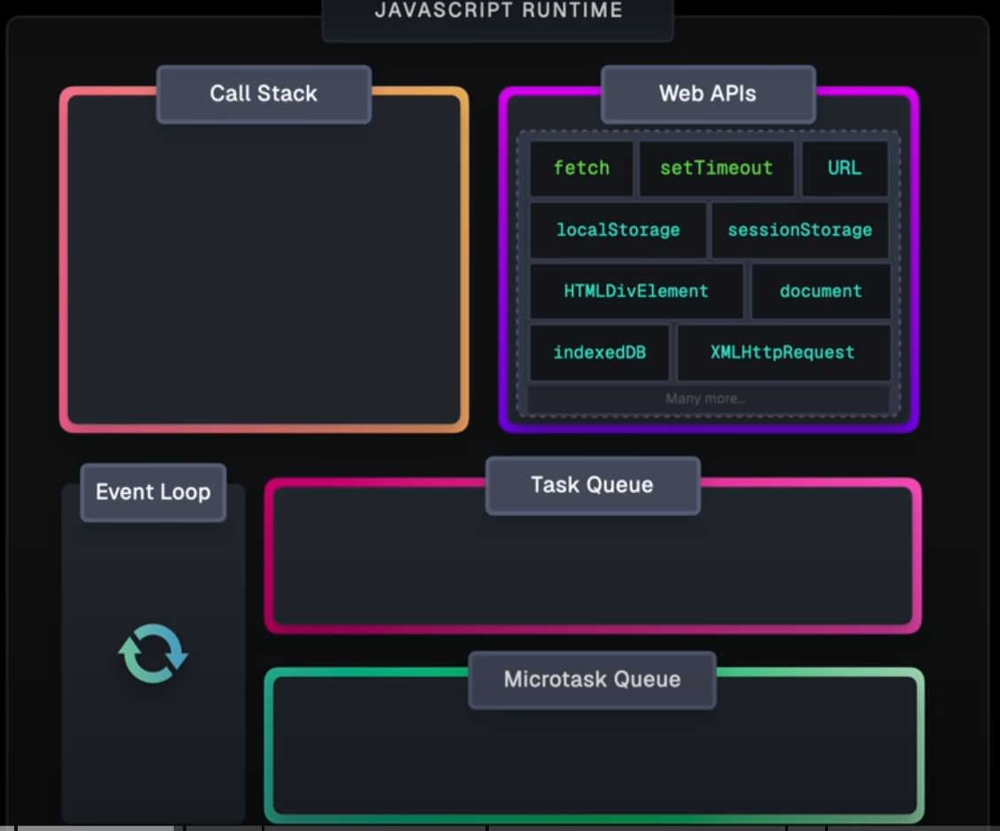

title: '[JS] Task queue'
author: Wei
date: 2024-04-26 22:28:54
tags:
---

<!-- more -->

# 參考資料
- [[Javascript] 深入了解事件迴圈(Event Loop)，Macrotask跟Microtask是什麼？](https://gcdeng.com/series/Javascript/javascript-deep-dive-into-event-loop)

- [那些被忽略但很好用的 Web API / MutationObserver ](https://ithelp.ithome.com.tw/articles/10277536)

- [請說明瀏覽器中的事件循環 (Event Loop)](https://www.explainthis.io/zh-hant/swe/what-is-event-loop)

<iframe width="560" height="315" src="https://www.youtube.com/embed/eiC58R16hb8?si=6ZaDCmyFwd_y6yUV" title="YouTube video player" frameborder="0" allow="accelerometer; autoplay; clipboard-write; encrypted-media; gyroscope; picture-in-picture; web-share" referrerpolicy="strict-origin-when-cross-origin" allowfullscreen></iframe>